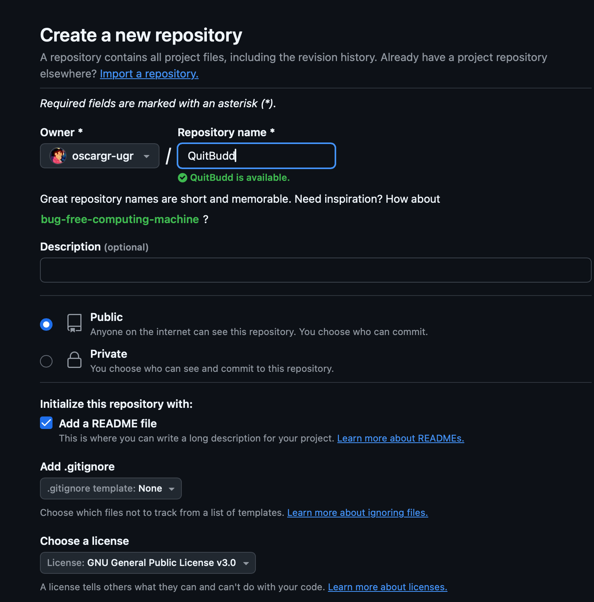
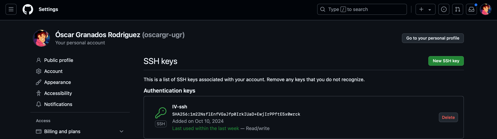

# Configuración Inicial del Repositorio

Seleccioné la casilla de crear un README.md.
Licencia de uso libre GNU General Public License v3.0.
No seleccioné el formato del archivo .gitignore, por lo que tuve que crearlo más tarde manualmente.

# Generar un par de claves pública y privada usando ecdsa con sha256

ssh-keygen -t ecdsa -b 256 -C "oscargr2014@gmail.com"

#Configuración de perfil de GitHub

